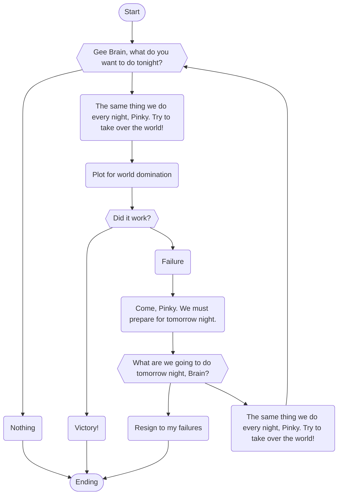

# @JRCharney

I am **Jason Charney** (@JRCharney).

- 👋 Hi, I’m @jrcharney
- 👀 I’m interested in ...
- 🌱 I’m currently learning ...
- 💞️ I’m looking to collaborate on ...
- 📫 How to reach me ...

## Current Programming Interests
- **HTML5**
- **CSS3**
- **HTML5 Canvas from scratch.** Not all the time but with those drawing that should be simple.
- **SVG from scratch.** Again, not all the time, but with those simple drawing.
- **JavaScript (especially functional programming).** All your `.filter()`, `.map()`, and `.reduce()` are belong to us!
- **Node.js** to make use of that JavaScript on the server side.
- **JSON** is fun to tinker with if you import it from a separate file.
- **Git** to keep my skills here sharp
- **[Leaflet](https://leafletjs.com/) and [OpenStreetMaps](https://www.openstreetmap.org/)** - I recently worked on a Bootcamp project that reignited my interest in it.
- **[OpenWeatherMap](https://openweathermap.org/) and [National Weather Service API](https://weather-gov.github.io/api/)** - Another project that fulfilled a long time dream uses OWM, but I want to transition the app to use the NWS API.
- **[Ruby](https://www.ruby-lang.org/).** Simple functional programming. A lot easier to pick up than [Haskell](https://www.haskell.org/). [This site](http://learnyouahaskell.com/) does help with learning Haskell, but have you downloaded a program that uses Haskell. It's Dependency Hell!
- **[Python](https://www.python.org/).** Trying to learn it. It's not hard. It's just trying to find time to do it. I bought a book on it right before I started the Wash U Bootcamp thinking I was going to spend my autumn (2022) finally learning how to use this.
- **Markdown with LaTeX and [Mermaid](https://mermaid-js.github.io/)**. Did you know you can add Math and Diagrams?  Check this out!

$$
\begin{aligned}
\text{For } u = f(x), v = g(x) \\
\frac{d}{dx}(u \pm v) &= \frac{du}{dx} \pm \frac{dv}{dx} && \text{Sum/Difference Rule} \\
\frac{d}{dx}(u \cdot v) &= \frac{du}{dx} \cdot v + u \cdot \frac{dv}{dx} && \text{Product Rule} \\
\frac{d}{dx}\left(\frac{u}{v}\right) &= \frac{\frac{du}{dx} \cdot v - u \cdot \frac{dv}{dx}}{v^2} && \text{Quotient Rule}, v \ne 0
\end{aligned}
$$

Pretty cool, right?

## Things you should know about my programming style

### I rarely use CSS Frameworks (e.g. Bootstrap). 
It's easier just to make something up from scratch.  Seriously.

If you look at my more recent projects I've done with the Washington University of St. Louis Coding Bootcamp, you will notice that I use the same stylesheets.

In most cases, I just compartamentalize my CSS code based on major componets, establish a color scheme, reuse previous animations.

Styling the Bootstrap way defeats having a stylesheet in the first place, is like writing code in HTML4 (which was deprecated over 20 years ago), and frankly you should have your own library of styles anyway to define yourself as a web developer.

### I eschew installing every plugin.

There was a quote from *The Dilbert Future* by Scott Adams (before he became what he is now): 

> "In the future, technology will make us less productive."

And he was right. Some plugins in VS Code just WRECK code and also break the automatic text insertion. Do I want to use plugins that make sure I didn't forget to use colon, comma, or semicolon somewhere? Yes. Do I want it to turn my short one-liners into multi-line code? No.  Do I want it to insert a block of Bootstrap code I'll never use. ABSOUTELY NOT!  And I especially don't like it when I format my code a certain way that I know is functionally perficient only for the indenting to be undone by some plugin written by some screwball who peaked in high school.

The whole point: Don't install every plugin. There's a lot of stuff the Prettier folks got wrong.

* [Emmet](https://emmet.io/) is good for writing code.
* [JsDoc](https://jsdoc.app/) is good for documenting your JavaScript.
* [Jasmine](https://jasmine.github.io/) is good for Node Unit Testing.

### I prefer Linux.

Did you know I was turned down for a job once because I didn't own a Macbook?  I believe code should work on ANY operating system, but prefer to develop it on Linux.  You shouldn't have to take out a huge loan to buy a computer.  And you shouldn't be turned down for a job because you don't own an overpriced laptop.

Of course, the company seemed more like it was more interested in playing air hockey than it was writing code anyway. Their loss!

## Websites
- 🚧 [JRCharney.com](https://www.jrcharney.com/) 🚧 - It's been a while since I've updated this.
- [Dev.to/JRCharney](https://dev.to/jrcharney)
- [Codepen.io/JRCharney](https://codepen.io/jrcharney)
- 🚧 [JRCharney.github.io](https://jrcharney.github.io/) 🚧 - Under Construction
  - [Bootcamp Portfolio](https://jrcharney.github.io/bootcamp-portfolio/) - Eventually this will replace that.

## Education Background
- 2007: Maryville University, St. Louis, MO, Bachlors of Science in Computer Science
- 2020: LaunchCode Alumni, St. Louis, MO
- 2022-2023: Washington University of St. Louis, Coding Bootcamp, St. Louis, MO

## Contact
You can contact me here. I have a [LinkedIn](https://www.linkedin.com/in/jasoncharney/) profile, but that website sucks. It's such a crappy play.

